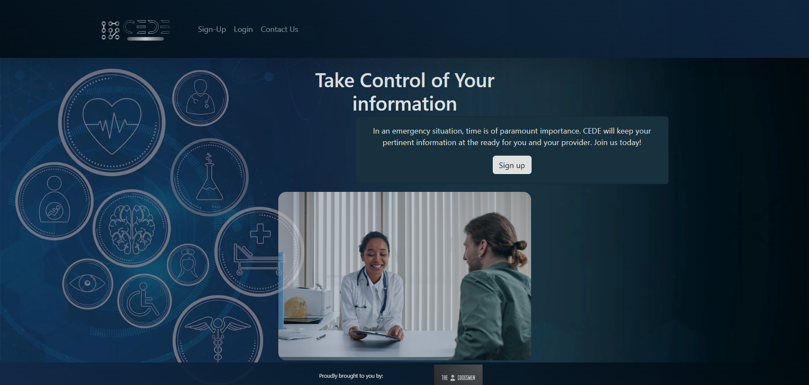
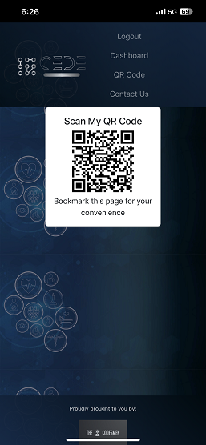
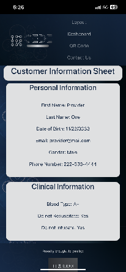
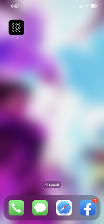

# CEDE - Take Control of your Information.

## About the Project

In this age of technological advancement, many companies still collect information with pen and paper. We make this process more efficient, convenient, and accurate for everyone by providing a tool to collect personal data once easily. We also allow our customers to CEDE (give) their data to our broad selection of partners with an easy-to-share QR code available through the CEDE secure portal.

We focus on facilitating the right for our customer to CEDE their data with our providers. With one CEDE account, you can safely store all of your data in one single place and grant entry via a QR code which standardizes the access to the provided information.

  
  
 
  
 Table of Contents
 
  
  - [About the Project](#about-the-Project)
    - [Built With](#built-with)
    - [Visuals](#visuals)
  - [Access](#access)
  - [Usage](#usage)
  - [Contributions](#contributions)
  - [Contact](#contact)
  - [License](#license)

  

### Built With

### Visuals

(<a href="#readme-top">back to top</a>)

## Access

### Link to the application's[ Repository ](https://github.com/EvolanGIT/Cede)

### Link to the [Deployed app](https://cede-qr-app.herokuapp.com/)

## Usage

The use of this application should be treated as a ``prototype``, we are at this point not responsible for any data submitted to our database as well as anyone who can access your information via the Qr code or the website itself. If you would like us to delete any sensitive information you might have shared with us, please contact us at cedeqr@gmail.com

## Contributors

- [Denart Ifurung](https://github.com/difurung) 
- [Charles Beatty](https://github.com/beattycharles) 
- [Alberto De Armas](https://github.com/nosbeto) 
- [Yon Bermudez](https://github.com/EvolanGIT) 
- [Edwin Pietrowksi](https://github.com/BogartDME) 

## Contact

Constructive comments and insight is always welcome. Please Email us at cedeqr@gmail.com

## License

Copyright "The Codesmen" 2023, please contact us for permission to use our application partially or totally.

  
(<a href="#readme-top">back to top</a>)

